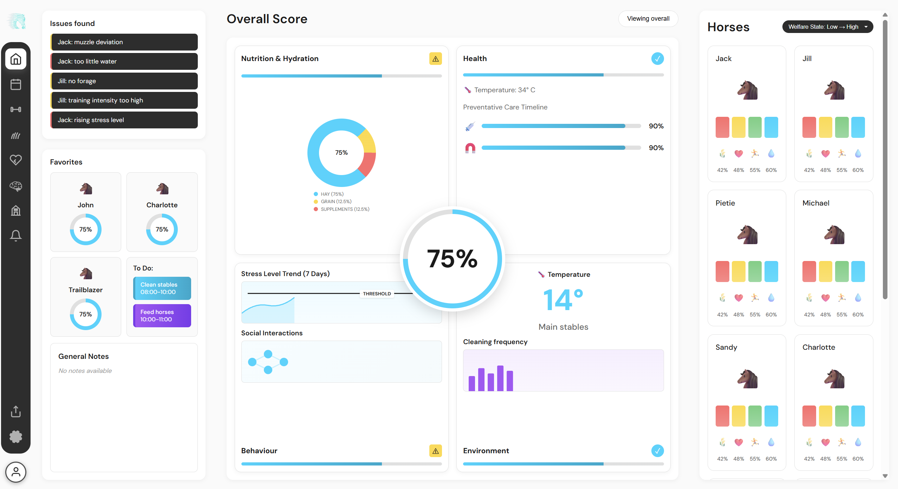

# Equine Integration Dashboard

Side project creating the main design from my industry project with Equine Integration just using HTML and CSS

## Live Demo

**[View the dashboard here](https://equinedashboard.netlify.app/)*

Deployed on Netlify.

---

## Features

- **Individual Horse Cards**: Monitor up to 12 horses with detailed stat tracking
- **Visual Analytics**: 
  - Donut charts for nutrition breakdown
  - Line charts for stress level trends
  - Network diagrams for social interactions
  - Bar charts for cleaning frequency
- **Interactive Sidebar**: Quick navigation with icon-based menu and floating design
- **Color-coded Indicators**: Visual warnings and status checks for quick assessment
- **Timeline Tracking**: Preventative care schedules with progress indicators

---

## Dashboard Sections

### Left Panel
- **Issues Found**: Quick alerts for horses requiring attention
- **Favorites**: Quick access to monitor favorite horses
- **To Do**: Task management integrated into favorites grid
- **General Notes**: Custom notes and observations

### Center Panel
- **Overall Score**: 75% overall welfare indicator
- **Nutrition & Hydration**: Donut chart showing hay, grain, and supplement distribution
- **Health Metrics**: Horse temperature monitoring (34°C) and preventative care timelines
- **Behaviour Analysis**: Stress level trends and social interactions trends
- **Environment**: Temperature monitoring (14°) and cleaning frequency tracking

### Right Panel
- **Horse Grid**: Individual cards for each horse showing:
  - Horse emoji icons
  - Nutrition, Health, Activity, and Hydration stats
  - Quick status icons (🥗 💊 🏃 💧)
  - Welfare status filter

---

## Tech Stack

- HTML5
- CSS3
- Darker Grotesque Fonts 

No external libraries or frameworks are used.

---

## Features Breakdown

### Visual Elements
- **Floating sidebar** with rounded dark navigation container
- **SVG icons** for crisp navigation (line-style design)
- **CSS-based charts** for lightweight visualization

### Data Visualization
- Donut charts with color-coded segments (cyan, yellow, red)
- Line charts with threshold indicators and labels
- Network diagrams for relationship mapping
- Bar charts for frequency tracking

### Navigation
- 10 navigation icons: Home, Calendar, Exercise, Nutrition, Health, Behaviour, Stable, Notifications, Export, Settings
- Export and Settings positioned at bottom of navbar
- Hover effects with smooth transitions

---

## Known Limitations

- Static data (no backend integration)
- No persistent data storage
- Fixed number of horses (12)
- CSS-based charts are static visualizations
- Not really responsive
- No JavaScript interactivity (pure HTML/CSS)

---

## Acknowledgments

- Dashboard design inspired by my Industry Project with Equine Integration
- AI assistance used during development for UI/UX refinement and implementation (Claude Sonnet 3.5)
- Logo design: Equine Integration Logo

---
